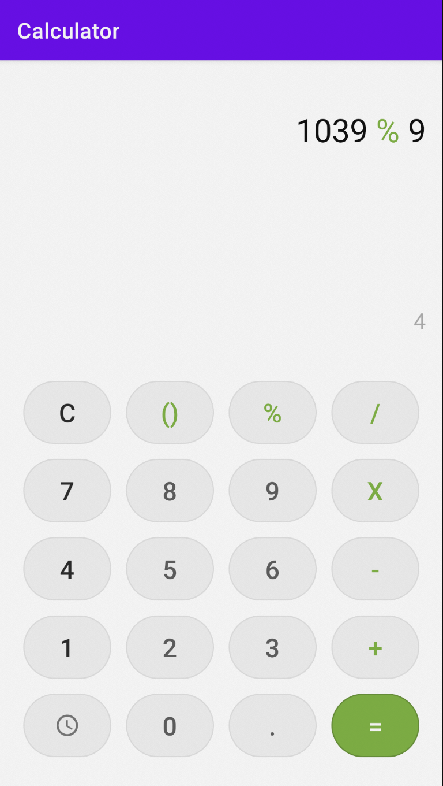
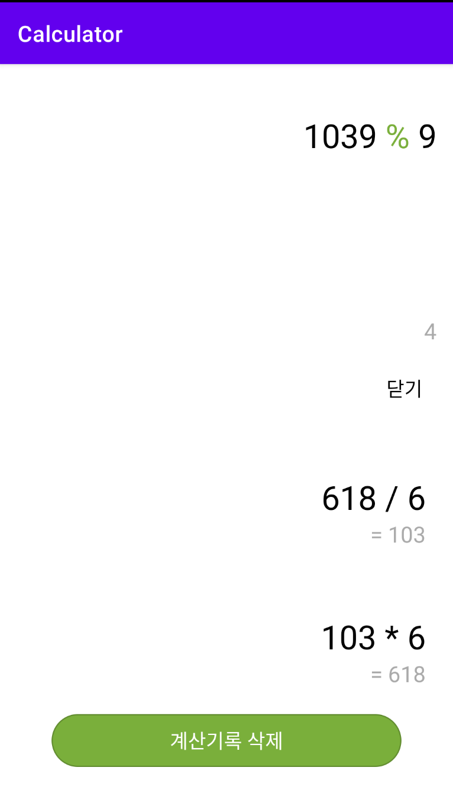

# 계산기

# 결과화면

# 이 프로젝트를 통해 배우는 것

- **Layout** 을 그리는 법
  - **TableLayout** 사용하기
  - **ConstraintLayout** 사용하기
  - **LayoutInflater** 사용하기
  
- **Thread** 사용하기

  - 타 Thread 만들어서 사용하기

  - **runOnUiThread** 사용하기

- **Room** 사용하기

### Kotlin 문법

확장 함수 사용하기

data class 사용하기

### 계산기

계산기 기능 수행

계산 기록 저장하기

계산 기록 삭제하기

~~단 시간관계 상 정수형으로 한정하고, 몇 가지 기능을 배제하고, 연산자는 1회만 사용할 수 있음~~